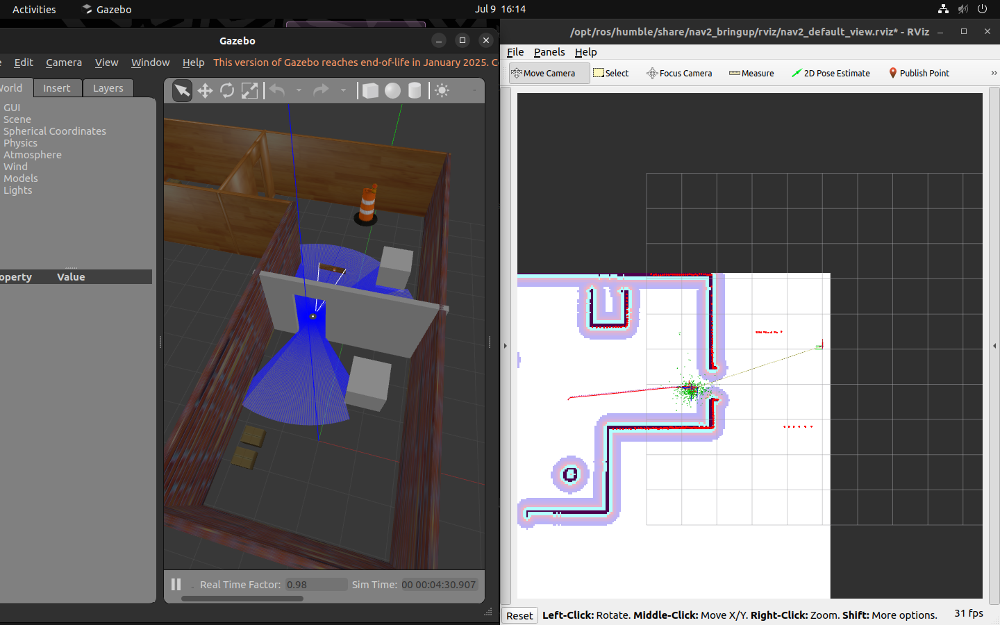

# Multi-Map Navigation with Wormhole Transitions

## Overview

This project implements a **multi-map navigation system** using ROS 2 and TurtleBot3. The robot is capable of navigating between separate room maps using a custom "wormhole" mechanism. Each room is independently mapped and linked through doorway regions (wormholes), and transitions are managed through custom C++ nodes, a custom action server, and an integrated SQL database.

The system is designed to simulate realistic indoor navigation across multiple, spatially-disjoint environments—ideal for facilities such as warehouses, hospitals, or labs.


Robot navigating in map1 to the wormhole coordinates



Robot navigating in map2 after passing through wormhole towards the goal

<details>
  <summary><strong>Installation Instructions</strong></summary>

### Prerequisites

- ROS 2 Humble
- TurtleBot3
- SLAM Toolbox
- SQLite3
- Navigation 2
- nlohmann_json library

### Installation Steps

```bash
mkdir wormhole_navigation/src
cd ~/wormhole_navigation/src
git clone <https://github.com/nirmalram07/wormhole_navigation.git>
cd ../
colcon build --packages-select turtlbot3_gazebo turtlebot3_spawn wormhole_nav_msg
source install/setup.bash
colcon build --packages-select wormhole_navigation
```

### Launch methods

(ps: I hope you're inside the wormhole_navigation folder)

#### Terminal tab 1(Gazebo custom world launcher)

```bash
source install/setup.bash
ros2 launch turtlebot3_gazebo turtlebot3_world.launch.py
```

#### Terminal tab 2(Navigation 2 launcher)

```bash
source install/setup.bash
ros2 launch turtlebot3_spawn turtlebot_gazebo.launch.py
```

#### Terminal tab 3(Flow control server)

```bash
source install/setup.bash
ros2 run wormhole_navigation wormhole_navigator
```

#### Terminal tab 4(Wormhole navigation demo client)

```bash
source install/setup.bash
ros2 run turtlebot3_spawn wormhole_nav_client
```

</details>

---

## Features

- Independent mapping of rooms using SLAM Toolbox (`async_slam_toolbox_node`)
- Wormhole-based transitions between maps through overlapping doorways
- Autonomous navigation using Nav2 and AMCL
- SQL-based storage and retrieval of wormhole coordinates
- Custom C++ Action Server for inter-map goal handling
- Added doxygen style comments for ease of documenting

---

## Package Structure

```bash
wormhole_navigation/
├── turtlebot3_gazebo/ # Opensource package for spawning turtlebot3 in custom world
├── turtlebot3_spawn/ # Launch files for navigation and initial pose pub
├── wormhole_nav_msg/ # Custom action definition (.action file)
├── wormhole_navigation/ # Main logic: Custom action server and DB handling

```

---

## Future Improvements

- Implement a Breadth first search method for navigating to the goal pose's map. As scaling this to x number of maps is slightly difficult.

- Implement error handling codes for edge cases.

---
